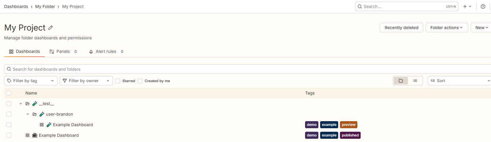
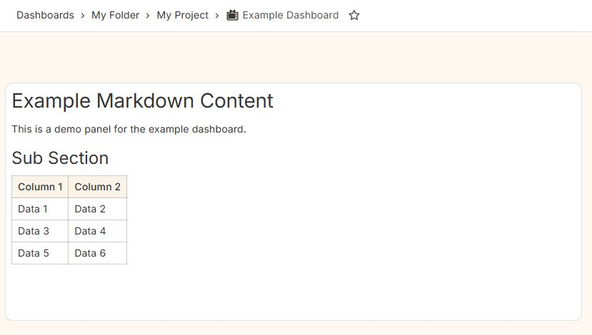
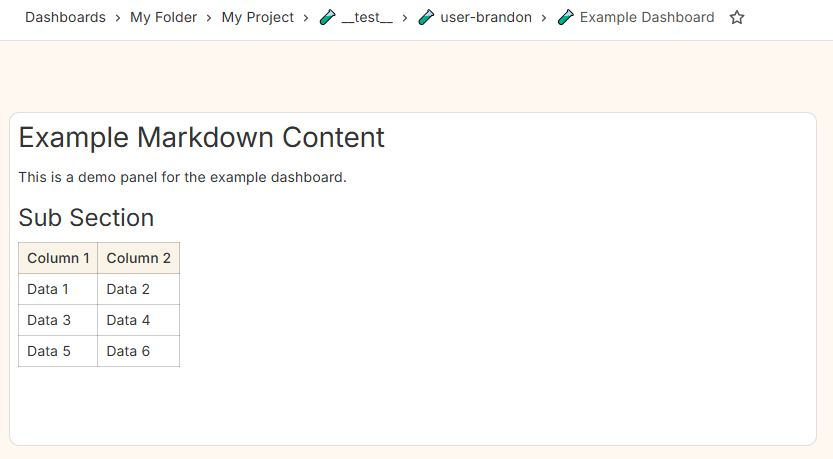

# Create a new project from scratch

## Prerequirements

- Node installed
- yarn installed (if you want to use yarn, otherwise you can adapt the commands to npm/pnpm/your tool of choice)

## Steps

- In an empty directory, run the following command to create a new project:

```bash
yarn init .
yarn set version berry
yarn config set nodeLinker node-modules
```

- Install base libs for grafana dashboard as code manager:

```bash
yarn add @gdacm/base-types@latest @gdacm/grafana-items@latest @gdacm/dashboard-manager@latest --no-time-gate
```

- Install dev dependencies for typescript and tsx:

```bash
yarn add -D typescript tsx
```

- Edit the package.json to add the following scripts:

```json
{
    [...]
    "main": "src/index.ts",
    "type": "module",
    [...]
    "scripts": {
        "dev": "tsx src/index.ts",
        "build": "tsc",
        "start": "node dist/index.js"
    },
    [...]
}
```

- As your project you'll probably end-up in git, just create now a `.gitignore` file to exclude various files and directories that should not be committed.

**file**: `.gitignore`

```gitignore
node_modules
*.lock
!yarn.lock
dist
out
ref
local

.yarn/*
!.yarn/cache
!.yarn/patches
!.yarn/plugins
!.yarn/releases
!.yarn/sdks
!.yarn/versions
```

Note that by convention, output files generated at runtime are generated in the `out` directory, and local configuration that should absolutly not be committed to version control is stored in the `local` directory.

- Add a basic tsconfig.json file to the root of your project:

**file**: `tsconfig.json`

```json
{
    "compilerOptions": {
        "rootDir": "src",
        "outDir": "dist"
    }
}
```

- Create a `src` directory and add an `index.ts` file with the following content:

**file**: `src/index.ts`

```ts
import { createDashboards } from '@gdacm/dashboard-manager';
import dashboardsInfos from './dashboards';
import infoCode from './info';

const main = async () => {
    await createDashboards(['./local'], './out', infoCode, dashboardsInfos);
}

main().catch(console.error);
```

With this setup, you are creating all the dashboards defined in your `dashboardsInfos` structure (that will be defined in `./dashboards` folder) and it will use the configuration located in your `infoCode` structure (that will be defined in `./info` file).

The [info](info.md) structure is basically a JSON object that contains the configuration for your dashboards, such as data source UIDs, folder IDs, and other relevant settings required by the `createDashboards` function that can be configured.

Note that the `Info` structure correspond to the merge of the infoCode you provide, with the `info.json` or `info.yml` that is present in the `./local` directory and some environnement variables that can patch that structure. See page [info](info.md) for more details.

- Create a `info.ts` in the `src` directory with the following content:

**file**: `src/info.ts`

```ts
export default {
    projectVidPrefix: "my-project",
    projectRootGrafanaFolder: "My Project",
};
```

- Now you need to have a `dashboards` folder in the `src` directory with an `index.ts` file that exports your dashboards information. 

- Let's create the folder `dashboards` in the `src` directory and add a `example.ts` file with the following content:

**file**: `src/dashboards/example.ts`

```ts
import { DashboardMetaOptions } from "@gdacm/base-types";
import { DashboardInfo } from "@gdacm/dashboard-manager";
import { Dashboard, GrafanaItem, TextPanel } from "@gdacm/grafana-items";

const getDashboard = async (uid: string, metaOptions: DashboardMetaOptions): Promise<GrafanaItem> => {
    return new Dashboard(metaOptions)
        .setUid(uid)
        .setTitle(metaOptions.title)
        .setTags(metaOptions.tags)
        .addPanel(
            new TextPanel(metaOptions)
                .setPos(0, 0, 12, 9)
                .setDescription('Demo Panel')
                .withOptions(
                    options => options
                        .withCode(
                            code => code
                                .setLanguage('plaintext')
                                .setShowLineNumbers(false)
                                .setShowMiniMap(false)
                        )
                        .setContent(
`
# Example Markdown Content
This is a demo panel for the example dashboard.
## Sub Section
| Column 1 | Column 2 |
|----------|----------|
| Data 1   | Data 2   |
| Data 3   | Data 4   |
| Data 5   | Data 6   |
`
                        )
                        .setMode('markdown')
                )
        )
}

export default new DashboardInfo()
    .setEmoji("📺")
    .setSid("example-dashboard")
    .setTitle("Example Dashboard")
    .setTags(["example", "demo"])
    .setDashboardGenerator(getDashboard)
```

That file is creating a dashboard in the `getDashboard` function and exporting it as a `DashboardInfo` object.

- Now create a `index.ts` file in the `dashboards` folder that exports your dashboard collection (that only contains one dashboard for now) with the following content:

**file**: `src/dashboards/index.ts`

```ts
import { DashboardsInfo } from "@gdacm/dashboard-manager";
import example from "./example";

export default new DashboardsInfo(
    example
)
```

- Right now, you have the most basic structure. An entry point that loads configuration, your dashboards collection, and try to generate your dashboards and then upload them in grafana

You can even run it right now. It will fail, because you never have specified the Grafana server configuration or authentication details, but it will generate the json dashboard. Let's try it out to verify everything is fine.

- Run the following command to generate the dashboard JSON:

```bash
yarn start
```

You should see something like:

```text
🔨📊 Generating dashboards for project: my-project in folder: ./out/my-project 
📊 Generating dashboard: undefined
📊 Creating dashboard for sid: example-dashboard (📺 Example Dashboard)
📝 Writing dashboard to file: ./out/my-project/example-dashboard.json
🖥️ Creating dashboards on Grafana undefined for project "my-project"
📁 Folder not found (or name mismatch) on Grafana, creating folder: My Project with vid: my-project
Error: GrafanaApi: Missing required parameters. Please provide both 'apiUrl' and 'apiToken'.
    at GrafanaApi.get _parameters (/home/aov/work/example/node_modules/@gdacm/dashboard-manager/src/api/GrafanaApi.js:24:19)
    at GrafanaApi.createFolder (/home/aov/work/example/node_modules/@gdacm/dashboard-manager/src/api/GrafanaApi.js:53:41)
    at DashboardManager.generateDashboards (/home/aov/work/example/node_modules/@gdacm/dashboard-manager/src/DashboardManager.js:286:38)
    at async createDashboards (/home/aov/work/example/node_modules/@gdacm/dashboard-manager/src/dashboards.js:30:5)
    at async main (/home/aov/work/example/src/index.ts:6:5)
```

You can see that a local folder `./out/my-project` has been created to store the generated dashboard JSON files. A file named `example-dashboard.json` has been written to this folder.

- Now you can start to configure your Grafana server and authentication details. First you need a service account with an API token inside Grafana. Create one, or ask you administrator to create it or provide you with a token for a service account.

For that, you need to configure the key `apiUrl` and `apiToken` in info structure. You can do it by editing the `src/info.ts` file *but* it is not recommanded, as this file is usually committed to version control and may expose your credentials.

Instead, you could either set these in a file named `local/info.json` or `local/info.yml` and put those values there, or you can set them as environment variables `GDM_API_URL` and `GDM_API_TOKEN`.

Any key in the info in the code will be overridden by the corresponding key in the local configuration file, and environment variables will take precedence over both.

If you define the key `include` as an array of strings, the names will be used to include other files in the local folder.

For example, if you have a local folder with additional configuration files named `extra.json` and `more.yml`, you can include them like this:

**file**: `local/info.yml`

```yml
include:
  - extra
  - more
```

It's usefull to manage several instances of grafana, you can put the configuration for each instance in separate files and include them as needed.

- Let's create a local configuration file to store your Grafana server and authentication details.

**file**: `local/info.yml`

```yml
apiUrl: "https://your-grafana-instance.example.com"
apiToken: "9b10a787-your-api-token-f80ab1234567890"
```

- Now start your application, and it will use the local configuration file to connect to your Grafana instance.

```bash
yarn start
```

- Now your how output may look like:

```text
🔨📊 Generating dashboards for project: my-project in folder: ./out/my-project 
📊 Generating dashboard: example-dashboard
📊 Creating dashboard for sid: example-dashboard (📺 Example Dashboard)
📝 Writing dashboard to file: ./out/my-project/example-dashboard.json
🖥️ Creating dashboards on Grafana https://gra13.v.jgi.fr for project "my-project"
📁 Folder not found (or name mismatch) on Grafana, creating folder: My Project with vid: my-project
📊 Creating dashboard on Grafana: 📺 Example Dashboard in folder vid: my-project
👌 Dashboard created: {"folderUid":"my-project","id":3534236040871936,"slug":"f09f93ba-example-dashboard","status":"success","uid":"my-project-example-dashboard","url":"/d/my-project-example-dashboard/f09f93ba-example-dashboard","version":1}
```
    
If you don't have an error, you can skip the next paragraph. In most corporate environments, you (in fact your service account) are not allowed to create a folder at the root level of Grafana. And that's what it done in this example.

You're probably allowed to create subfolders within an existing folder. If it's not the case, it means you have been provided with a service account that is not allowed to create the folders and the dashboard, thus is useless : contact your Grafana administrator. 

I'll consider you have access to a subfolder within Grafana where you can create subfolders for your team. So you need to go to that folder in Grafana.

When you're inside that folder, look at the URL in your browser. For exemple it should look like this: `https://your-grafana-instance.example.com/dashboards/f/dfxqw30bbao74d/my-folder/`. Note `dfxqw30bbao74d` as it is the folder UID.

- Edit your `local/info.yml` file to include the `projectRootVid` key with the folder UID you noted:

**file**: `local/info.yml`

```yml
apiUrl: "https://your-grafana-instance.example.com"
apiToken: "9b10a787-your-api-token-f80ab1234567890"
projectRootVid: "dfxqw30bbao74d"
```

And restart the application in previous steps.

- You should now see a dashboard at url `https://your-grafana-instance.example.com/d/my-project-example-dashboard`.

Notice how the dashboard URL is predictable based on the project vid prefix and the dashboard sid. For more informations about id, uid, vid and sid, refer to the [vid](vid.md) page.

That dashboard is located in a folder called "My Project" as it's the `projectRootGrafanaFolder` key in the info structure.

That folder itself it either at the root level of Grafana or within the folder specified by the `projectRootVid` key if you provided one.

## About testing graphs without overriding existing dashboards

Even with unit tests, there always come a time when you want to see in grafana how your dashboards look like without overriding the existing ones.

This lib provides a very easy way to test your dashboards : the "test name" feature.

If instead of creating dashboards directly, you provide a "test name" (by setting the `testName` key in your info structure, or setting the `GDM_TEST_NAME` environment variable), the dashboards will be created in a separate location, allowing you to test them without overriding the existing ones until you're satisfied with the changes.

Just start:

```bash
GDM_TEST_NAME="user-brandon" yarn start
```

- All the dashboards will be generated in the grafana folder structure `My Project/__test__/user-brandon/` instead of `My Project/`. Note that all emoji you can set on dashboards will also replaced by the emoji 🧪 so it helps to visually distinguish test dashboards from the main ones.

And now, it's up to you to use that for the CI/CD. One usefull usage is for example:

- Each developper in local has a unique test name in it's local/info.yml file like `testName: user-brandon` or `testName: u-brandon`, thus any dashboards generated by that developer will be a test dashboards, in a place that never conflicts with the main dashboards.
- On commit, the CI/CD publish each feature branch with be generated in `testName: branch-<branch name>` or `testName: b-<branch name>`
- Only the dashboards commited on the `main` branch will be generated in the main location without the `testName` prefix.

But depending on your preferences, you might want to only generate official dashboards on tags, and never on simple commits, or genrate a `testName: tag-<tag name>` for each tag. That's up to you.

## Summary

You have now a project that allows you to manage Grafana dashboards as code, with predictable URLs and proper folder organization.

You can find a project at the end of this tutorial at https://github.com/gdacm/tutorial-create-project

### The dashboard structure created by this project



### The published dashboard



### The preview dashboard


